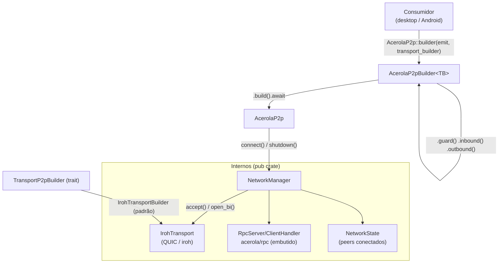
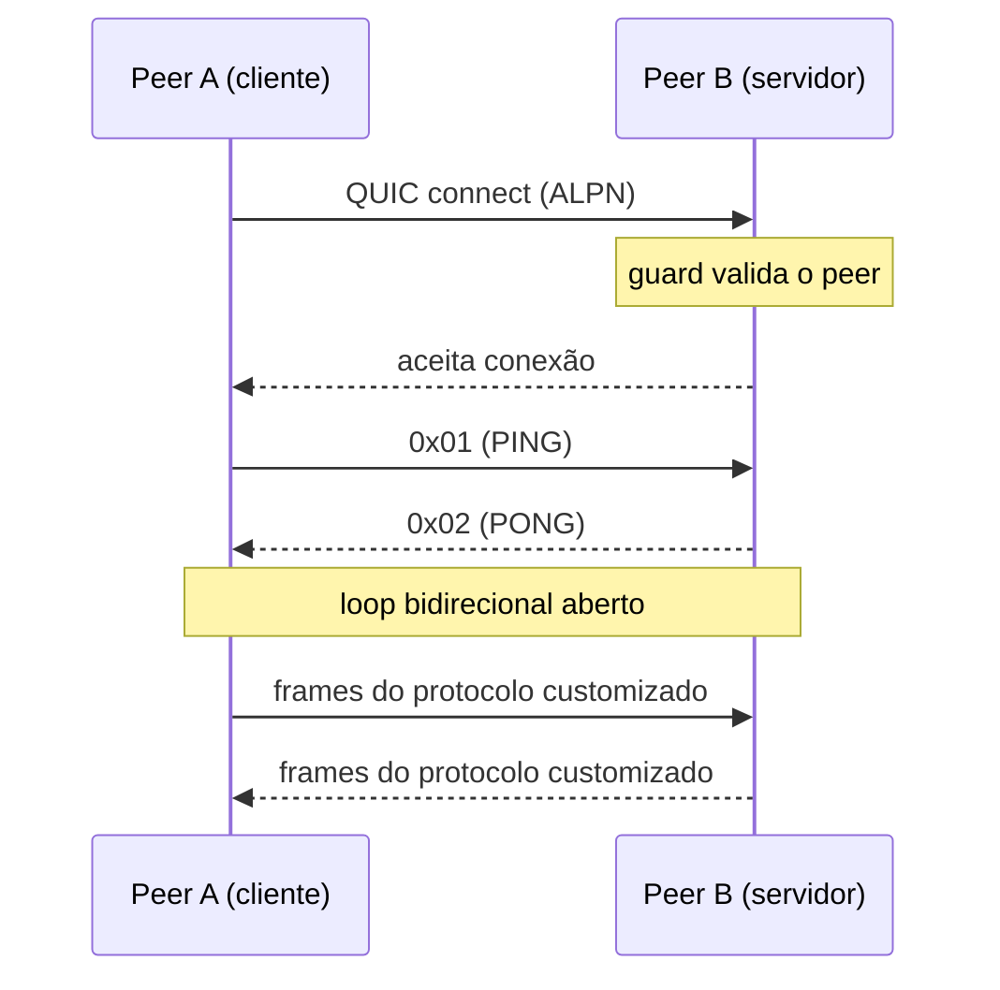

# acerola-p2p

Biblioteca P2P central do projeto Acerola. Compartilhada entre desktop e Android (futuramente iOS). Construída sobre [iroh](https://github.com/n0-computer/iroh) (QUIC) com tokio.

---

## Arquitetura



---

## Como funciona



---

## Uso

Adicione ao `Cargo.toml`:

```toml
[dependencies]
acerola-p2p = { git = "https://github.com/your-org/acerola-p2p" }
```

### Configuração mínima

```rust
use std::sync::Arc;
use acerola_p2p::{AcerolaP2p, EventEmitter};
use acerola_p2p::transport::iroh::IrohTransportBuilder;

#[tokio::main]
async fn main() {
    let emit: EventEmitter = Arc::new(|event, data| {
        println!("[{event}] {data}");
    });

    let node = AcerolaP2p::builder(emit, IrohTransportBuilder::default())
        .build()
        .await
        .expect("falha ao iniciar o nó");

    println!("id local: {}", node.local_id());
}
```

### Com relay configurado

```rust
let node = AcerolaP2p::builder(emit, IrohTransportBuilder::default()
        .relay("https://meu-relay.example.com"))
    .build()
    .await?;
```

Sem relay configurado, o nó opera apenas via mDNS local (`RelayMode::Disabled`).

---

## Injetáveis

### `EventEmitter`

Callback disparado a cada evento interno. No desktop, encapsula `app.emit()`. No Android, encapsula uma chamada JNI.

```rust
let emit: EventEmitter = Arc::new(|event, data| {
    // event: "rpc:ping_received" | "rpc:pong_sent" | ...
    // data:  id do peer
    println!("[{event}] {data}");
});
```

---

### `TransportP2pBuilder`

Interface que desacopla a criação do transport do builder principal. O padrão é `IrohTransportBuilder`, mas qualquer implementação da trait pode ser injetada:

```rust
use acerola_p2p::transport::TransportP2pBuilder;

struct MeuTransportBuilder;

#[async_trait]
impl TransportP2pBuilder for MeuTransportBuilder {
    type Output = MeuTransport;

    async fn build(self, alpns: Vec<Vec<u8>>) -> Result<MeuTransport, P2pError> {
        // monta o transport com os ALPNs recebidos
    }
}

let node = AcerolaP2p::builder(emit, MeuTransportBuilder)
    .build()
    .await?;
```

---

### `Handler` (ProtocolHandler)

Implemente essa trait para tratar um protocolo ALPN customizado. Recebe um stream bidirecional bruto por conexão.

```rust
use std::sync::Arc;
use async_trait::async_trait;
use acerola_p2p::{Handler, P2pError, PeerIdentity};
use tokio::io::{AsyncRead, AsyncWrite};

struct BlobHandler;

#[async_trait]
impl Handler for BlobHandler {
    async fn handle(
        &self,
        peer: &PeerIdentity,
        mut send: Box<dyn AsyncWrite + Send + Unpin>,
        mut recv: Box<dyn AsyncRead + Send + Unpin>,
    ) -> Result<(), P2pError> {
        // leitura e escrita de bytes brutos sobre o stream QUIC
        Ok(())
    }
}

let node = AcerolaP2p::builder(emit, IrohTransportBuilder::default())
    .inbound(b"acerola/blob", Arc::new(BlobHandler))   // aceita conexões entrantes
    .outbound(b"acerola/blob", Arc::new(BlobHandler))  // inicia conexões saintes
    .build()
    .await?;
```

O mesmo ALPN deve ser registrado nos dois lados. `inbound` trata conexões que chegam neste peer; `outbound` trata conexões que este peer inicia via `connect()`.

---

### `Guard` (BoxedValidator)

Função assíncrona chamada antes de qualquer conexão entrante ser aceita. Retorne `Err` para rejeitar.

```rust
use acerola_p2p::{Guard, P2pError};

// Aberto — aceita qualquer peer (padrão)
let aberto: Guard = Box::new(|_ctx| Box::pin(async { Ok(()) }));

// Allowlist — apenas peers conhecidos
let permitidos = vec!["peer-id-abc".to_string(), "peer-id-xyz".to_string()];
let allowlist: Guard = Box::new(move |ctx| {
    let peer_id = ctx.peer_id.id.clone();
    let permitidos = permitidos.clone();
    Box::pin(async move {
        if permitidos.contains(&peer_id) {
            Ok(())
        } else {
            Err(P2pError::AuthDenied)
        }
    })
});

let node = AcerolaP2p::builder(emit, IrohTransportBuilder::default())
    .guard(allowlist)
    .build()
    .await?;
```

---

### Conectar a um peer

```rust
// O ALPN deve corresponder a um handler outbound registrado
node.connect("peer-id-string", b"acerola/blob").await?;
```

### Encerrar o nó

```rust
node.shutdown().await?;
```

---

## Protocolo embutido

`acerola/rpc` é registrado automaticamente em todo nó. Executa um keepalive ping/pong (`0x01` / `0x02`) para confirmar conectividade e dispara eventos no `EventEmitter`:

| Evento | Direção |
|---|---|
| `rpc:ping_sent` | cliente → servidor |
| `rpc:pong_received` | cliente ← servidor |
| `rpc:ping_received` | servidor ← cliente |
| `rpc:pong_sent` | servidor → cliente |

Não é necessário registrar esse handler — ele sempre está presente.
